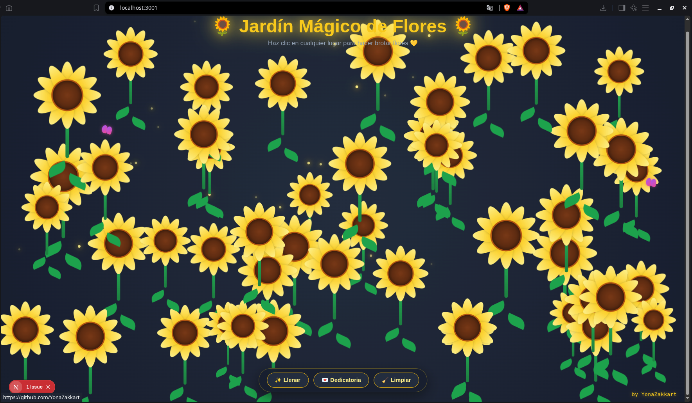
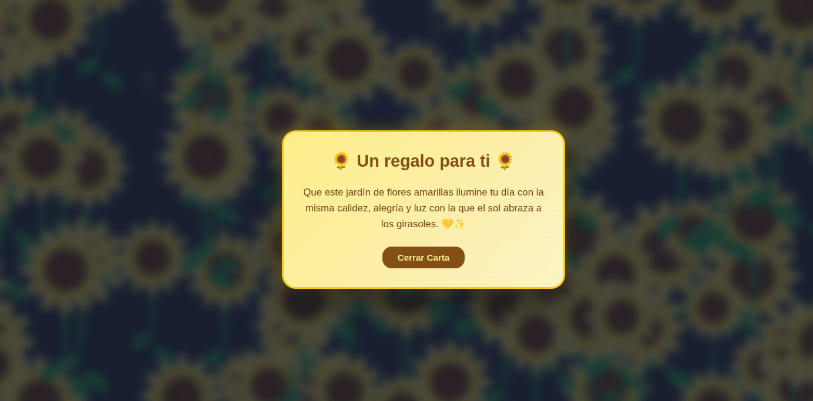

<h1 align="center">
  
  Flores Amarillas
</h1>

<p align="center">
  Un jardín interactivo de girasoles y flores amarillas animadas construido con Next.js, CSS3 puro, brisa de viento, luciérnagas, mariposas y efectos de sonido sintéticos.
</p>

<p align="center">
  <a href="https://YonaZakkart.github.io/flores-amarillas/" target="_blank">
    
  </a>
</p>

---

## Vista Previa

<p align="center">
  
  
</p>

---

## Requisitos Previos

Antes de comenzar, asegúrate de tener instalado:

* **Node.js** (versión 18.x o superior)
* **npm** (versión 9.x o superior)

---

## Instalación y Ejecución Local

Sigue estos pasos para ejecutar el proyecto en tu máquina:

**Clonar el repositorio:**
   ```bash
   git clone https://github.com/YonaZakkart/flores-amarillas.git
   ```
Entrar a la carpeta del proyecto:

```Bash
cd flores-amarillas
```
Instalar las dependencias:

```Bash
npm install
```
Correr el servidor de desarrollo:

```Bash
npm run dev
```
Abre http://localhost:3000 (o el puerto indicado en tu terminal) en tu navegador para ver la aplicación.
